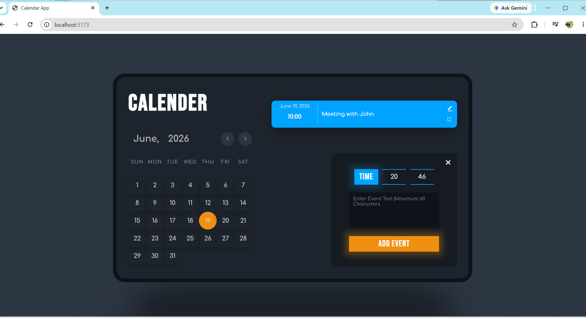

# React Calendar App

A modern and responsive calendar application built with React that helps users organize their schedules by creating, editing, and managing events directly from an interactive monthly calendar interface.


##  Preview



## Features

*  Interactive monthly calendar view
*  Navigate seamlessly between months and years
*  Add events to specific dates
*  Edit existing events
*  Delete events
*  Set event times
*  Persistent event storage using Local Storage
*  Clean and modern user interface
* Fully responsive design for mobile and desktop devices
*  Automatic calendar generation based on selected month and year

##  Live Demo

Add your deployed application URL here.

Example:

```text
https://react-calendar-mr3q.onrender.com/
```
##  Built With

* React 19
* Vite
* JavaScript (ES6+)
* CSS3
* HTML5
* Local Storage API

## Installation

### 1. Clone the repository

```bash
git clone https://github.com/ritujane78/react_calendar.git
```

### 2. Navigate to the project folder

```bash
cd react_calendar
```

### 3. Install dependencies

```bash
npm install
```

### 4. Start the development server

```bash
npm run dev
```

### 5. Open in browser

```text
http://localhost:5173
```

## How to Use

1. Open the application.
2. Navigate through months using the calendar controls.
3. Select a date.
4. Add a new event with a title and time.
5. Edit existing events whenever needed.
6. Delete events that are no longer required.
7. All events are automatically saved in your browser.
